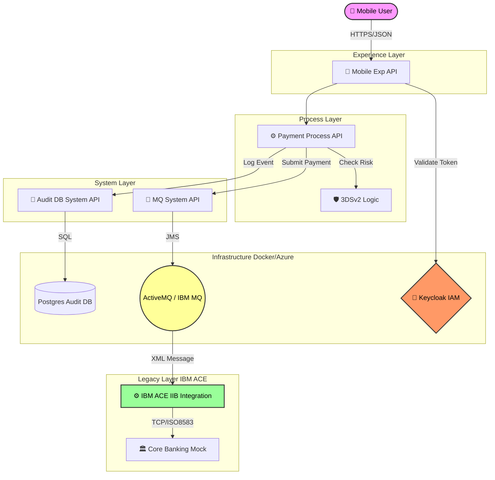
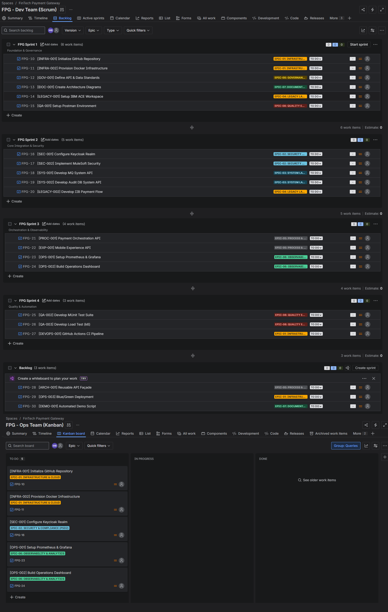
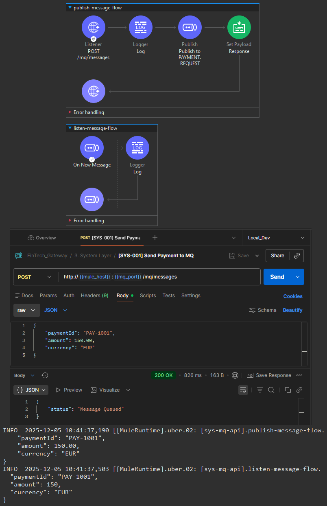
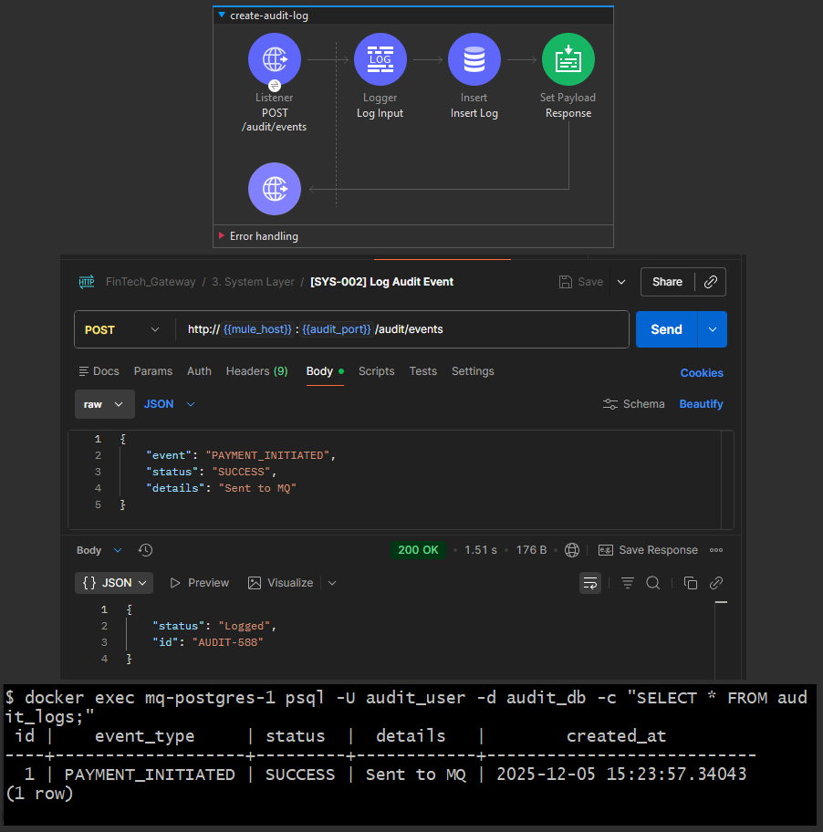

# FinTech Payment Gateway (PSD2/SCA)

  

An enterprise integration platform demonstrating **Hybrid Connectivity** between modern REST APIs (MuleSoft) and legacy core banking systems (IBM ACE/MQ).

---

## 🎯 Project Scope

This project implements a PSD2-compliant payment initiation flow. It simulates a Tier-1 banking environment where:

- **MuleSoft** handles the Experience and Process layers (SCA validation, Orchestration).
- **IBM ACE (IIB)** manages the System of Record connectivity (Legacy XML, Mainframe).
- **Azure & Docker** provide the underlying infrastructure (API Management, Identity, Messaging).

---

## 🌍 Architecture

### High-Level Design

This solution bridges the gap between Cloud-Native Experience APIs and On-Premise Mainframe systems using an Event-Driven Architecture.



---

## 🏗 Tech Stack & Compliance

| Component       | Technology               | Role                               |
| :-------------- | :----------------------- | :--------------------------------- |
| **Integration** | MuleSoft 4 (Community)   | API-Led Connectivity               |
| **Legacy**      | IBM ACE 12 (App Connect) | Core Banking Adapter               |
| **Messaging**   | ActiveMQ                 | JMS Broker (Simulating IBM MQ)     |
| **Security**    | Keycloak                 | OAuth2 & OpenID Connect (PSD2 SCA) |
| **Database**    | PostgreSQL               | Audit & Transaction Log            |
| **Monitoring**  | Prometheus + Grafana     | Observability & Tracing            |

### Compliance Matrix

- **PSD2 SCA:** Implemented via Keycloak MFA & MuleSoft Policies.
- **ISO 20022:** Canonical Data Model enforced at the System Layer.
- **GDPR:** PII Redaction Middleware implemented in Process Layer.

---

## 🚀 Getting Started

**Prerequisites:** Docker, Anypoint Studio, IBM ACE Toolkit.

```bash
# 1. Clone Repository
git clone https://github.com/mirzazohaib/Fintech-Payment-Gateway.git

# 2. Start Infrastructure (MQ, Auth, DB)
docker-compose -f mq/docker-compose.yml up -d
```

---

## 🧪 Testing Strategy

- **Unit:** MUnit (Mule), ESQLUnit (IBM).
- **Integration:** Postman Collections (in \`/tests/postman\`).
- **Load:** k6 scripts (in \`/scripts/load-testing\`).

---

## 📉 Agile Delivery Methodology

This project follows a strict **Hybrid Agile** methodology managed via JIRA, separating Development (Scrum) from Operations (Kanban).

- **Sprints:** 2-week delivery cycles for API and Integration logic.
- **Kanban:** Continuous flow for Infrastructure (Docker/Azure) and Observability tasks.
- **Epics:** Structured by Architectural Layer (System, Process, Experience).



---

## 📸 Implementation Evidence (Sprint 2)

### 1. MQ System API (JMS Integration)

**Goal:** Establish asynchronous connectivity between the Integration Layer and the Message Broker.
**Proof:** The composite screenshot below demonstrates:

1.  **Mule Flow:** The System API publishing a JSON payload to the `payment.request` queue.
2.  **Client Request:** Postman successfully submitting a payment (`200 OK`).
3.  **Consumption:** The Mule JMS Listener asynchronously picking up the message from ActiveMQ logs.



### 2. Audit DB System API (PostgreSQL Persistence)

**Goal:** Persist transaction logs to a secured Audit Database for compliance.
**Proof:** The composite screenshot below demonstrates:

1.  **Mule Flow:** The System API accepting a JSON log event.
2.  **Persistence:** The **Database Connector** successfully inserting the record into the Postgres container (port 5435).
3.  **Verification:** The SQL query confirms the data is committed to the `audit_logs` table.


