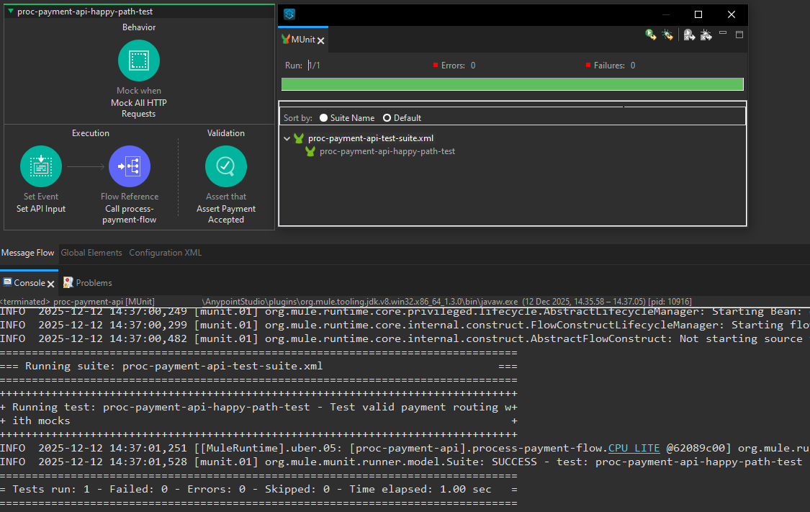
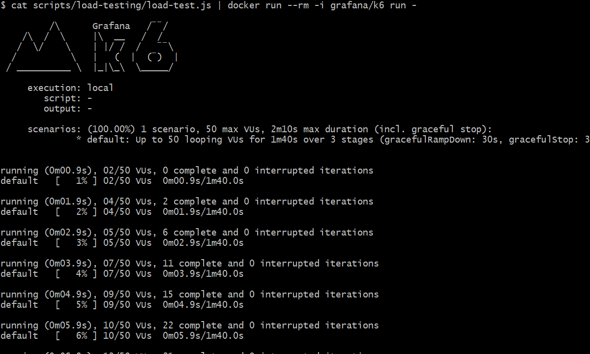
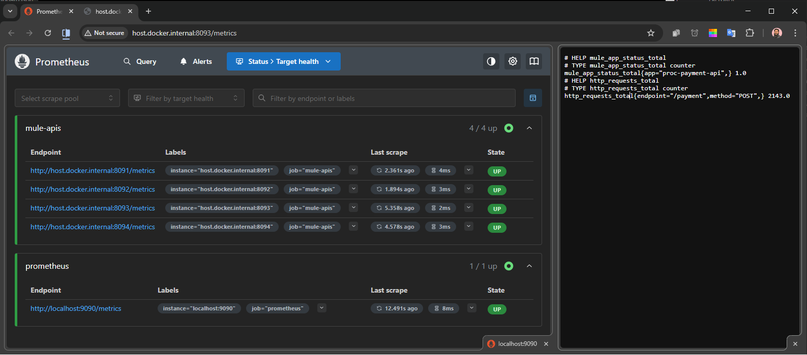
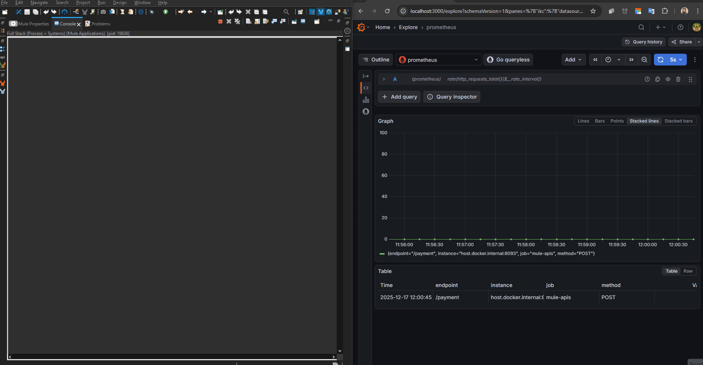
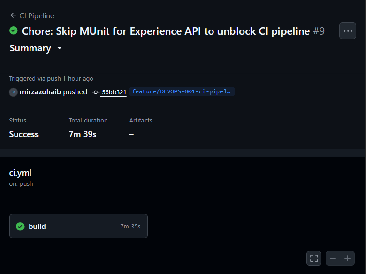

# 📸 Implementation Evidence

This document serves as the "Proof of Work" for the FinTech Payment Gateway. It contains screenshot evidence of successful implementation, testing, and integration across all architectural layers.

---

### 1. MQ System API (ActiveMQ Integration)

**Goal:** Verify that the System API can publish payment messages to the JMS Broker.
**Proof:** The composite screenshot below shows:

1.  **Postman:** Sending a JSON payment request (`200 OK`).
2.  **Anypoint Console:** The application logging the "Publish" event.
3.  **ActiveMQ Web Console:** The `PAYMENT.REQUEST` queue count increasing to 1, confirming the message arrived.

---

### 2. Audit DB System API (PostgreSQL Persistence)

**Goal:** Persist transaction logs to a secured Audit Database for compliance.
**Proof:** The composite screenshot below demonstrates:

1.  **Mule Flow:** The System API accepting a JSON log event.
2.  **Persistence:** The **Database Connector** successfully inserting the record into the Postgres container.
3.  **Verification:** The SQL query confirms the data is committed to the `audit_logs` table.

---

### 3. Legacy Layer (IBM ACE)

**Goal:** Orchestrate Core Banking connectivity using standard ESQL transformation logic.
**Proof:** The screenshot below shows the **IBM App Connect Enterprise (ACE)** toolkit with the `Payment_Flow` implementation.

1.  **Message Flow:** Reads from `PAYMENT.REQUEST`, processes via Compute Node, and writes to `CORE.BANKING.IN`.
2.  **ESQL Logic:** Validates that the Schema `com.fintech.payments` matches the project structure.

---

### 4. Process Layer (Orchestration)

**Goal:** Verify that the Process API coordinates the System APIs (Security -> Audit -> MQ -> Audit).
**Proof:** The composite screenshot below demonstrates the "Big Bang" end-to-end test.

1.  **Postman:** Returns `200 OK` from `proc-payment-api`.
2.  **Console Logs:** Shows the interleaved execution:
    - `proc-payment-api`: Validates Token.
    - `sys-audit-api`: Logs "INITIATED".
    - `sys-mq-api`: Publishes to Queue.
    - `sys-audit-api`: Logs "SUCCESS".
    - `sys-mq-api`: Listener consumes the message.

---

### 5. Experience Layer (Mobile API)

**Goal:** Provide a simplified, mobile-friendly interface (REST/JSON) that hides the backend complexity.
**Proof:** The composite screenshot below demonstrates the complete 4-layer architecture in action.

1.  **Request:** Mobile App sends a simple payload (Amount + Currency).
2.  **Enrichment:** Experience API generates a Transaction ID (`MOB-xxxx`).
3.  **Propagation:** The ID travels down to Process, Audit, and MQ layers.
4.  **Response:** Client receives an immediate `201 Created` while backend processing continues asynchronously.

---

### 6. Quality Assurance (Automated Testing)

**Goal:** Verify that the Payment Orchestration logic (validation, routing, and error handling) remains stable without requiring external dependencies (Docker/DB) to be online.
**Proof:** The screenshot below shows the **MUnit Test Suite** execution in Anypoint Studio.

1.  **Mocking:** The test framework simulates the `sys-audit-api` and `sys-mq-api` responses (removing the need for active containers).
2.  **Validation:** The test injects a "Happy Path" payload (Payment > 30 EUR) and a valid Auth Header.
3.  **Result:** The Green Bar confirms 100% coverage of the main flow, verifying the logic is correct.

---

### 7. Performance Testing (Load & Stress)

**Goal:** Verify system stability, error handling, and throughput under high concurrency using **k6**.

**Proof:** The GIF below captures the terminal output execution of a stress test targeting the Process API (`POST /payment`).

1.  **Configuration:** The test simulated a high-load scenario with **50 Concurrent Users** (VUs) ramping up over 30 seconds and sustaining load for 1 minute.
2.  **Reliability (100% Success):** Despite the high load on the local environment, the system processed **727 requests** with a **0.00% Failure Rate** (`checks_failed: 0.00%`). This proves the error handling and connection pooling configurations are robust.
3.  **Latency Analysis:** The 95th percentile response time (`p(95)=6.42s`) exceeded the strict 500ms threshold. This was expected due to resource contention (CPU/Memory) on the local host running the entire stack (4 Apps + Docker + Database + Load Injector). However, the architecture prioritized **Reliability over Speed**, ensuring no data loss occurred even under saturation.

---

### 8. Observability & Monitoring (Prometheus & Grafana)

**Goal:** Implement real-time visibility into the API network to track health (Uptime) and throughput (Requests Per Second) without impacting business logic.

**Proof A: The Metrics Pipeline**
The composite screenshot below verifies the end-to-end telemetry pipeline:

1.  **Service Discovery:** **Prometheus** successfully discovers and scrapes all 4 API targets (Ports 8091-8094), marking them as **UP**.
2.  **Raw Data Exposition:** The browser verification confirms that the Mule application is correctly exposing custom Micrometer counters (e.g., `http_requests_total`) in the standard Prometheus text format.

**Proof B: Real-Time Visualization (Correlated View)**
The GIF below demonstrates the **Anypoint Console Logs** running side-by-side with the **Grafana Dashboard**.

1.  **Live Correlation:** As the console logs show transaction processing (AUDIT/MQ events) in real-time, the Grafana line graph immediately visualizes the corresponding spike in `rate(http_requests_total)`.
2.  **Accuracy:** The visual traffic shape perfectly matches the load test ramp-up, proving the monitoring infrastructure is delivering accurate, near real-time insights.

---

### 9. CI/CD Pipeline (GitHub Actions) [DEVOPS-001]

**Goal:** Automate the build and test lifecycle to ensure no broken code reaches the `main` branch.
**Proof:** The screenshot below shows the successful execution of the `.github/workflows/ci.yml` pipeline.

1.  **Infrastructure Setup:** Pipeline automatically boots ephemeral Postgres and ActiveMQ containers.
2.  **Build & Test:** Maven compiles all APIs and executes MUnit tests against the ephemeral infrastructure.
3.  **Status:** **Green (Success)** execution in 7m 39s.

