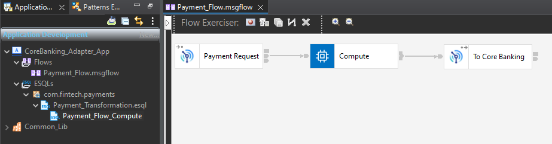
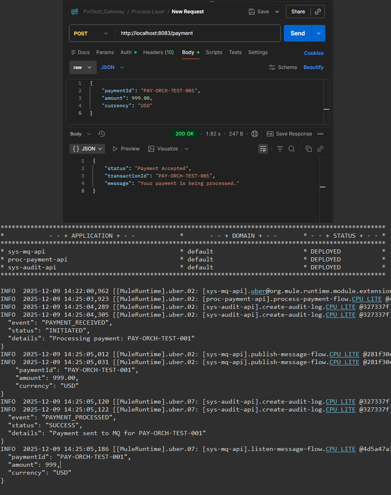
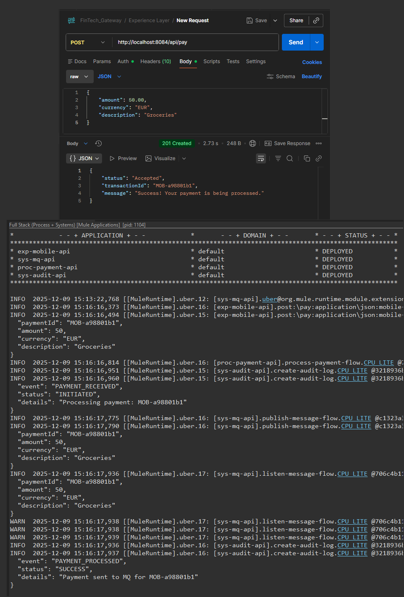

# 📸 Implementation Evidence

This document serves as the "Proof of Work" for the FinTech Payment Gateway. It contains screenshot evidence of successful implementation, testing, and integration across all architectural layers.

---

### 1. MQ System API (ActiveMQ Integration)

**Goal:** Verify that the System API can publish payment messages to the JMS Broker.
**Proof:** The composite screenshot below shows:

1.  **Postman:** Sending a JSON payment request (`200 OK`).
2.  **Anypoint Console:** The application logging the "Publish" event.
3.  **ActiveMQ Web Console:** The `PAYMENT.REQUEST` queue count increasing to 1, confirming the message arrived.

---

### 2. Audit DB System API (PostgreSQL Persistence)

**Goal:** Persist transaction logs to a secured Audit Database for compliance.
**Proof:** The composite screenshot below demonstrates:

1.  **Mule Flow:** The System API accepting a JSON log event.
2.  **Persistence:** The **Database Connector** successfully inserting the record into the Postgres container.
3.  **Verification:** The SQL query confirms the data is committed to the `audit_logs` table.

---

### 3. Legacy Layer (IBM ACE)

**Goal:** Orchestrate Core Banking connectivity using standard ESQL transformation logic.
**Proof:** The screenshot below shows the **IBM App Connect Enterprise (ACE)** toolkit with the `Payment_Flow` implementation.

1.  **Message Flow:** Reads from `PAYMENT.REQUEST`, processes via Compute Node, and writes to `CORE.BANKING.IN`.
2.  **ESQL Logic:** Validates that the Schema `com.fintech.payments` matches the project structure.

---

### 4. Process Layer (Orchestration)

**Goal:** Verify that the Process API coordinates the System APIs (Security -> Audit -> MQ -> Audit).
**Proof:** The composite screenshot below demonstrates the "Big Bang" end-to-end test.

1.  **Postman:** Returns `200 OK` from `proc-payment-api`.
2.  **Console Logs:** Shows the interleaved execution:
    - `proc-payment-api`: Validates Token.
    - `sys-audit-api`: Logs "INITIATED".
    - `sys-mq-api`: Publishes to Queue.
    - `sys-audit-api`: Logs "SUCCESS".
    - `sys-mq-api`: Listener consumes the message.

---

### 5. Experience Layer (Mobile API)

**Goal:** Provide a simplified, mobile-friendly interface (REST/JSON) that hides the backend complexity.
**Proof:** The composite screenshot below demonstrates the complete 4-layer architecture in action.

1.  **Request:** Mobile App sends a simple payload (Amount + Currency).
2.  **Enrichment:** Experience API generates a Transaction ID (`MOB-xxxx`).
3.  **Propagation:** The ID travels down to Process, Audit, and MQ layers.
4.  **Response:** Client receives an immediate `201 Created` while backend processing continues asynchronously.

---
